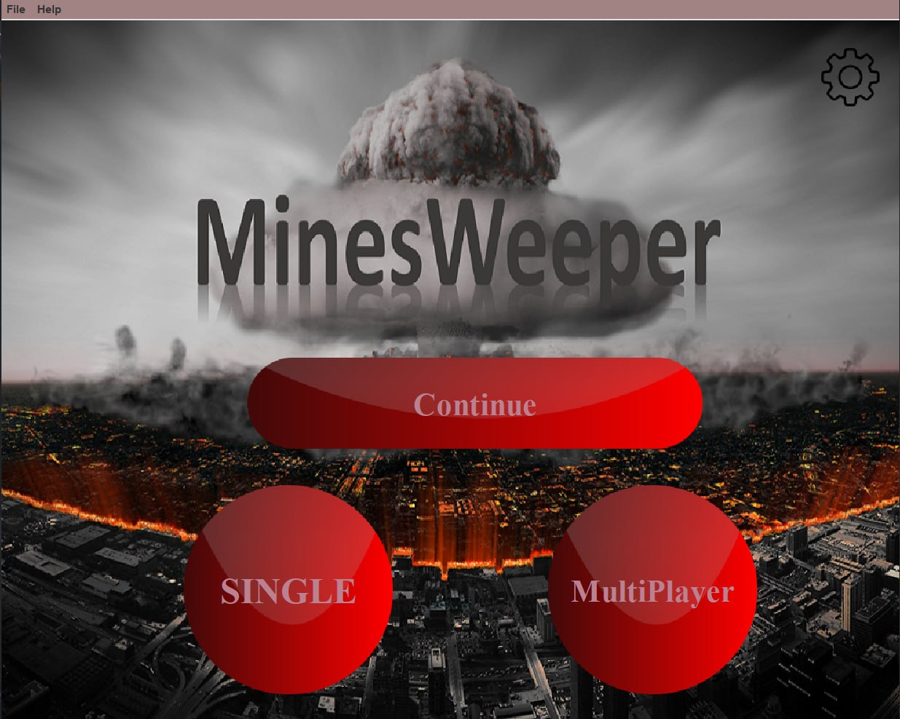
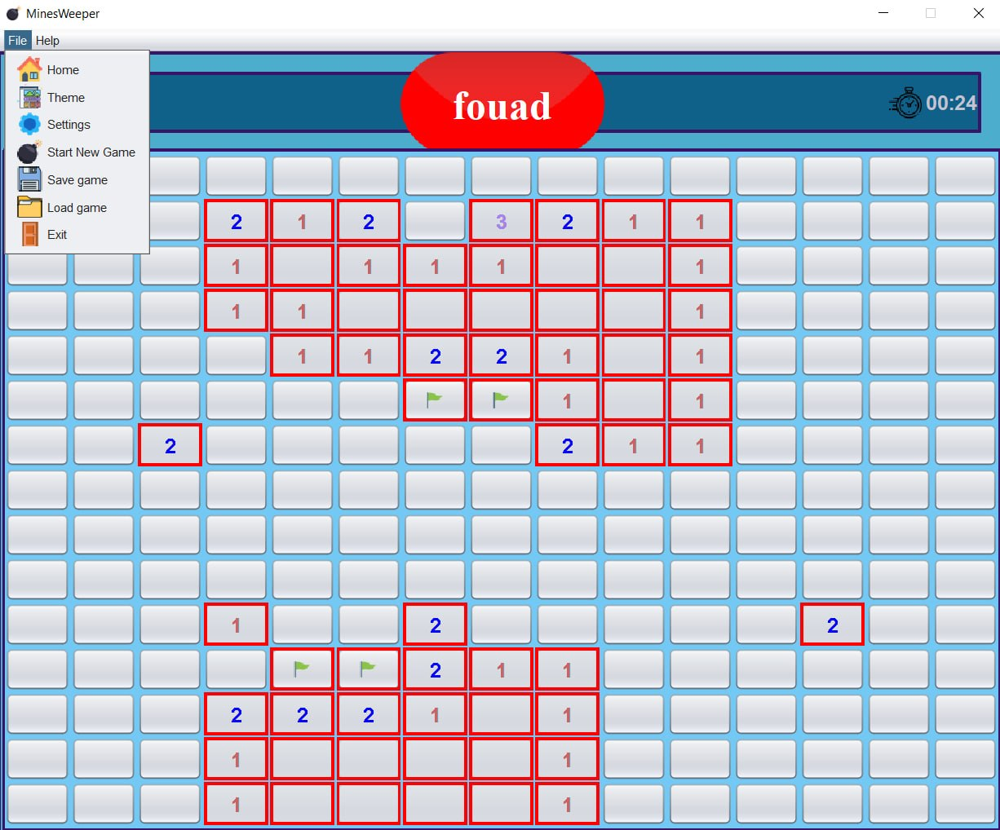
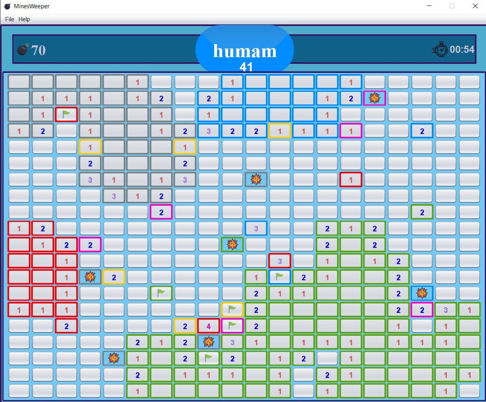
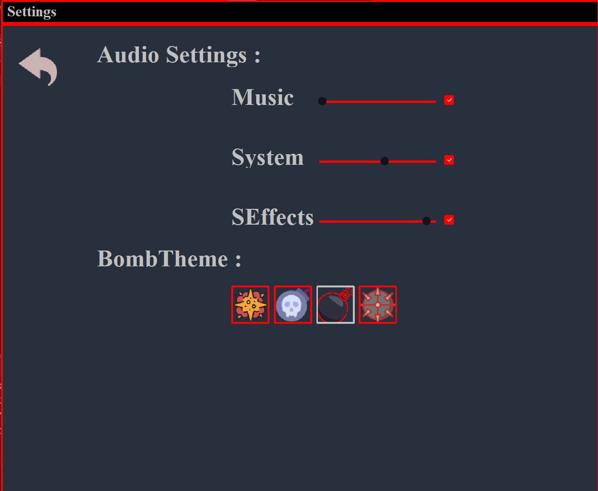
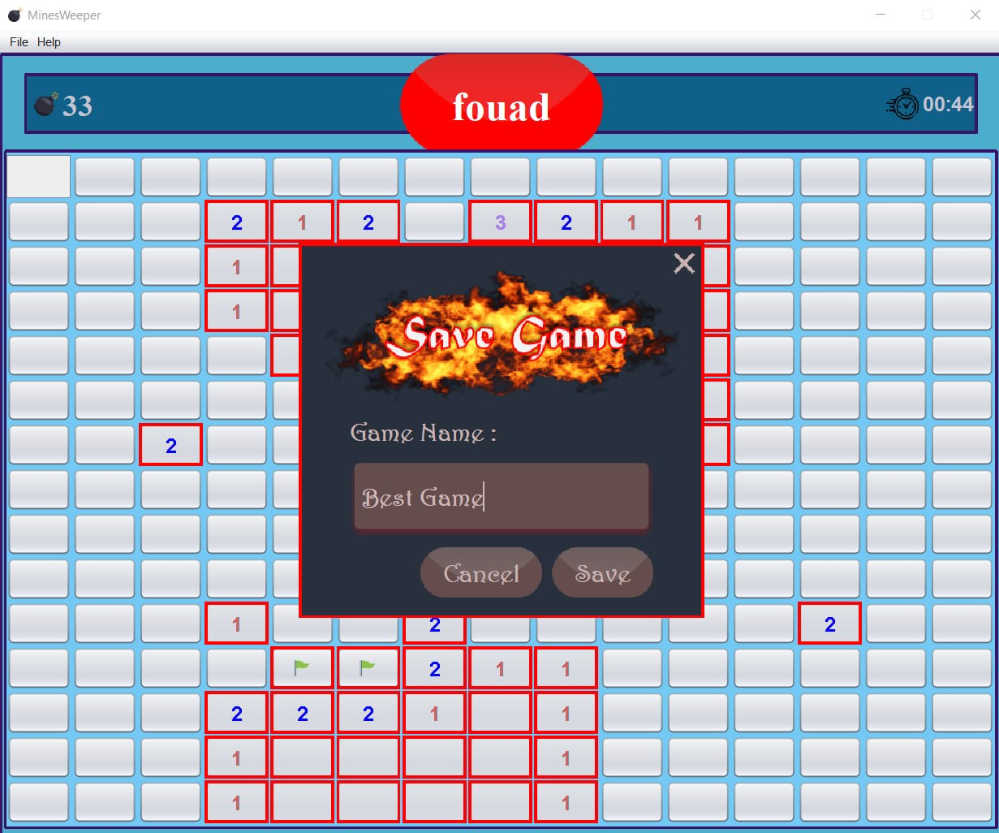

# Minesweeper — Java Swing Edition

A desktop Minesweeper game built with **Java** and **Java Swing**, featuring classic single-player gameplay, **local turn-based multiplayer for 2–8 players on the same computer**, multiple difficulty levels, scoring, sound, save/load support, autosave, pause/resume, and customizable game settings.

> **Legacy project note:** This project was originally developed during my early university years and was uploaded to GitHub later. The repository commit date therefore does not represent the original development date.

---

## Highlights

- Classic Minesweeper gameplay
- Java Swing desktop interface
- Object-oriented game logic
- **Local multiplayer for 2–8 players on the same computer**
- Multiple difficulty levels
- Per-player scoring and turn handling
- Save / load support
- Autosave and continue-game support
- Pause / resume
- Audio settings and sound effects
- Multiple bomb themes
- Timer-based gameplay
- Custom Swing screens and reusable UI components

---

## Screenshots

### Home & Game Modes

<p align="center">
  
</p>

The main screen provides **Continue**, **Single Player**, and **Local Multiplayer** modes.

### Single-Player Gameplay

<p align="center">
  
</p>

Classic Minesweeper gameplay with timer, remaining-mine counter, flagging, and in-game menu actions such as save/load and settings.

### Local Turn-Based Multiplayer

<p align="center">
  
</p>

The multiplayer mode is a **same-device hot-seat mode**: 2–8 players share the same computer and mouse, take turns on one board, and are tracked using individual names, colors, scores, and turn state.

### Settings & Themes

<p align="center">
  
</p>

Runtime settings include audio controls and selectable bomb themes.

### Save / Load Support

<p align="center">
  
</p>

Games can be named and saved manually, with additional autosave/continue support in the project.

---

## Local Multiplayer

The multiplayer mode is intentionally **local / hot-seat multiplayer**, not online networking.

Players use the same computer and mouse. At the start of the game:

1. Select **Multiplayer**.
2. Choose between **2 and 8 players**.
3. Enter each player's name.
4. Each player receives a distinct color.
5. Players take turns interacting with the same Minesweeper board.
6. The game tracks the current player and each player's score.

This was designed as a social same-device variation of traditional single-player Minesweeper.

---

## Project Structure

```text
src/
├── FileHandling/   # Save, load, autosave, serialized game data
├── Game_logic/     # Grid, cells, players, rules, scoring and turn handling
├── Images/         # Runtime image assets
├── Screen/         # Swing windows, menus, settings and game screens
├── Sound/          # Sound effects and audio handling
├── Timer/          # Gameplay timer
├── buttons/        # Custom Swing button components
└── Net/            # Old experimental networking code
```

The main implementation is separated into game logic, GUI, persistence, sound, timing, and reusable UI components.

---

## Core Classes

### Game Logic

- `Cell` — stores cell state and value
- `Grid` — manages the Minesweeper board
- `Player` — stores player name, color, score, and turn state
- `Rules` — game rules, scoring, player switching, and win/loss behavior

### User Interface

- `Home` — main menu and player setup
- `DIfficulty` — difficulty selection
- `game` — main gameplay window
- `Settings` — game/audio settings
- `SaveScreen` / `LoadGameGui` — persistence UI

### Persistence

- `SaveGame`
- `LoadGame`
- `AutoSave`
- `GameData`

---

## Technical Notes

The project demonstrates practical use of:

- Java OOP
- Java Swing
- Event-driven programming
- Mouse event handling
- Serialization
- File-based persistence
- Game-state management
- Turn-based multiplayer logic
- Custom scoring
- Timers and sound
- Separation of logic and UI into packages

Because this is an older learning project, the code also reflects an earlier stage of my software-development journey. I am keeping it public as part of my portfolio to show that progression.

---

## Running the Project

The project was originally developed as an IntelliJ IDEA Java project.

### Requirements

- Java JDK
- IntelliJ IDEA or another Java IDE

### Recommended setup

1. Clone the repository.
2. Open it as a Java project.
3. Mark `src` as the source root if required by your IDE.
4. Ensure the image and sound resources are available on the runtime classpath.
5. Run the main entry point in `Game_logic.Main`.

---

## Manual Runtime Verification

The current portfolio version has been manually exercised across the main user-facing flows, including:

- Home screen and game-mode selection
- Difficulty selection
- Single-player gameplay
- Local multiplayer and player-turn switching
- Pause / resume
- Settings and audio/theme controls
- Manual save and load flows
- Continue / autosave-related UI

This is a legacy learning project rather than a production release, so automated tests and a modern build pipeline are not currently included.

---

## Repository Cleanup

The public repository was uploaded after the original development period. As part of a portfolio cleanup, generated IDE/build files were removed while preserving the original source code and behavior.

---

## Possible Future Improvements

If I revisit the project, the highest-value improvements would be:

- Refactor large Swing classes into smaller components
- Introduce Maven or Gradle
- Add automated tests for grid/rules/scoring
- Improve resource organization
- Remove or complete the old experimental networking package
- Add optional LAN/online multiplayer as a **separate feature branch**
- Refresh the visual design while preserving the original game logic

---

## Author

**Fouad Dalloul**

Information Engineering student — Artificial Intelligence specialization  
Backend development, software engineering, AI, and applied systems.
